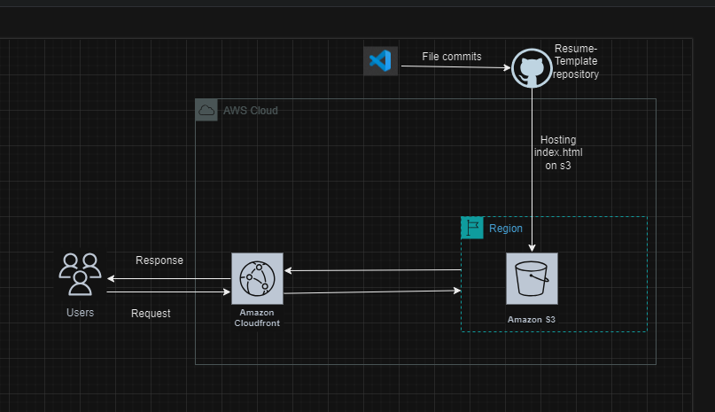

# Hosting a Static Resume Website on Amazon Simple Storage Service (Amazon S3)
  
## Description
_Resume Challenge is a step-by-step process of hosting a static resume website on Amazon Simple Storage Service(Amazon S3)._
Amazon S3 is an object storage service by AWS that offers scalability, security, data availability and performance.

## Architecture Diagram

## Prerequisite
- Create a HTML resume website and name the default page of the website as index.html.
- Ensure that you an AWS account.

## Set-Up Procedure
- Sign in to AWS Management Console, search and select S3 under 'Services'.

### Step 1: Create a bucket
1. Click on 'Create bucket'.
2. Choose the Region where you want to create the bucket from.
3. Enter the 'Bucket name'.
4. Scroll down and choose 'Create'.

### Step 2: Enable static website hosting for your bucket

1. Click on 'Buckets' on the left of your Amazon S3 Console window to access a list of your buckets.
2. Click on the name of the bucket you created above, to view the bucket's details.
3. Choose 'Properties'.
4. Scroll down to 'Static website hosting' and choose 'Edit'.
5. Under 'Static website hosting' choose 'Enable', and choose 'Save changes'.
6. Under 'Index document', enter the name of the default page of your website: index.html
7. Scroll down and choose 'Save changes'.

### Step 4: Upload website content to S3
1. While still in Amazon S3 console, select 'Buckets' on the left side of your screen.
2. Click on the name of your bucket, in the buckets list that shows on the main section of your screen.
3. Click on the 'Upload' button on the right side of your screen to upload your website's files/folders.
4. Click on 'Add files' or 'Add folder', depending on what you have for your website, and select the respective file or folder for your website.
5. Scroll down and click on 'Upload'.

### Step 5: Create an Amazon CloudFront Distribution
1. Search for and select 'CloudFront' from 'Services'.

2. Click 'Create distribution' to go to the 'Origin page.
3. For 'Origin domain', click on the 'Use website endpoint'.
4. For 'Origin access', choose 'Origin access control setting (Recommended).
5. For 'Origin access control', select 'Create new OAC'.
6. In the 'Create new OAC pane', leave everything as is and click on 'create'.   
7. For 'Web Application Firewall (WAF)', select one of the options.
8. Scroll down and click 'Create distribution'.   
9. Click on 'Copy policy' in the 'S3 bucket policy needs to be updated' banner.
10. In the same banner, click on the link to 'Go to S3 bucket permissions to update policy'.
11. Click on 'Permissions'.
12. For 'Bucket policy', click on the 'Edit' button.
13. Paste the policy copied in step 9 in the 'Edit statement' field, and click on 'Save changes'.
14. Return to the CloudFront console, review the 'Details' section for your new distribution. 'Last modified' field should display date and time once the distribution is done deploying.
15. Record the domain name assigned to your distribution by CloudFront.

#### Step 6: Demo
https://drb1id8xueecl.cloudfront.net/

## References
- [Tutorial: Configuring a static website on Amazon S3
](https://docs.aws.amazon.com/AmazonS3/latest/userguide/HostingWebsiteOnS3Setup.html)

- [Hosting HTML Pages Using AWS S3 and CloudFront: A Step-by-Step Tutorial](https://medium.com/@fabiokndt/hosting-html-pages-using-aws-s3-and-cloudfront-a-step-by-step-tutorial-8149476b11b4)

## Licenses
[MIT](https://opensource.org/license/mit)

_Copyright (c) 2024._ **By Rosemary Ojwang**
